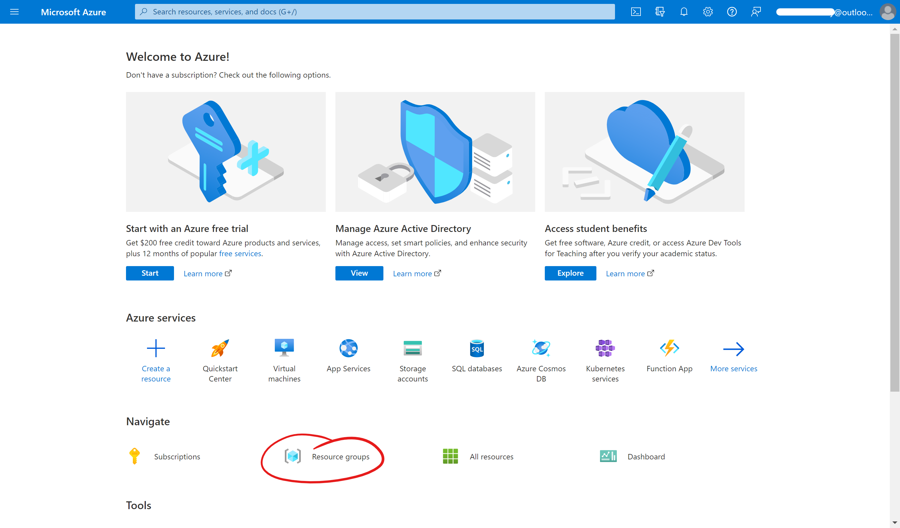
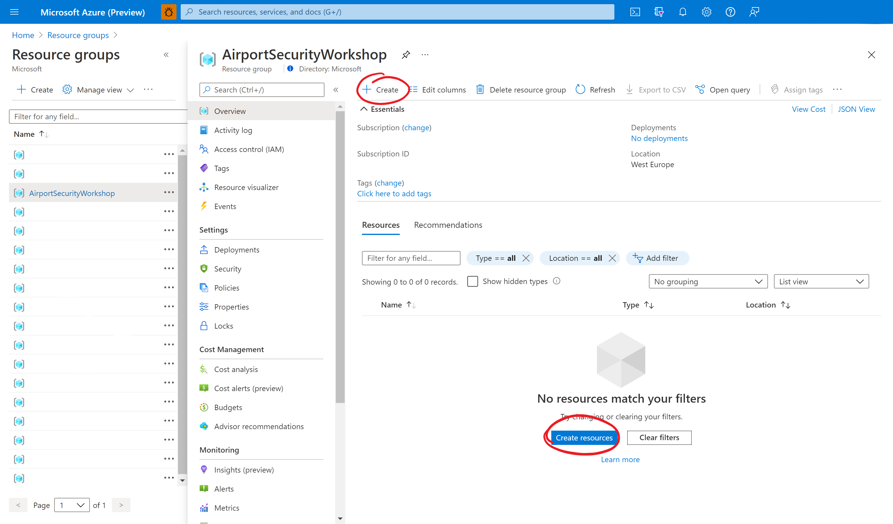
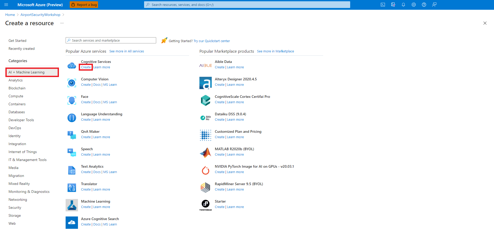
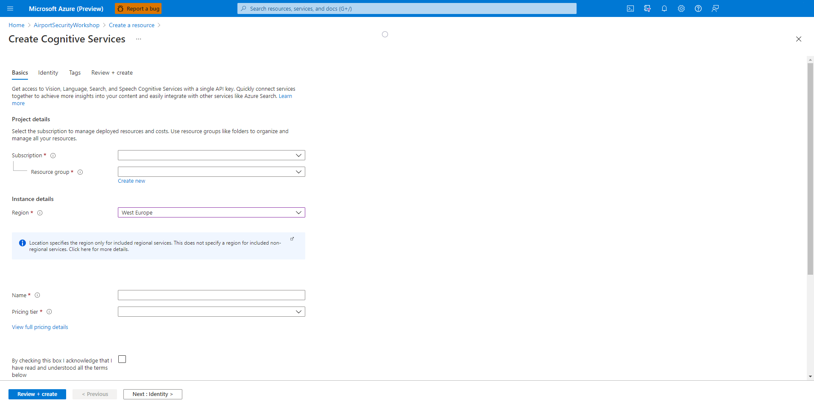
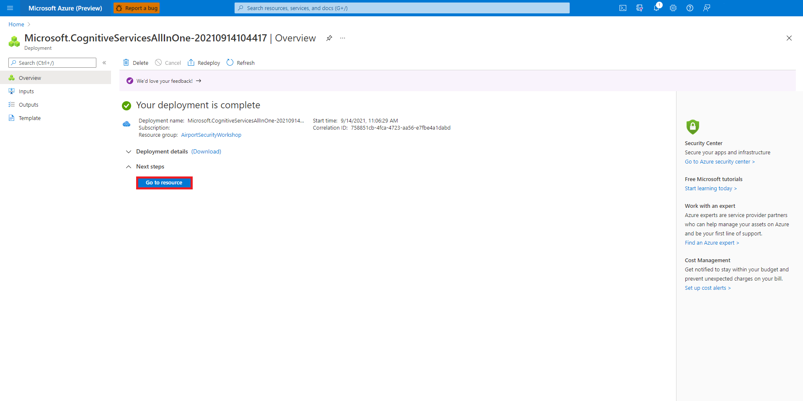

# Task 2 - Provision a Cognitive Services resource

In this task, you are creating a Cognitive Services resource, which gives you access to a wide range of AI services.

1. Before you can start deploying anything, you need to know where to do so. In your browser, navigate to the Azure portal at [portal.azure.com](https://portal.azure.com) and sign in with the email address of your Azure account. If this is your first time signing in, you might be offered a tour of the portal. You can do the short tour if you like, otherwise, select **Maybe later**.

1. Select the **Resource groups** icon under **Azure services** to see all the resource groups that you have access to.

    

    > ##### ℹ️
    > If you cannot see any resource groups, make sure that the correct subscription is selected in the filter.

1. There are many ways to create a resource in the Azure portal. While viewing your resource group, select either the **Create** button in the top or the **Create resources** button in the bottom.

    

1. On the next screen, select **AI + Machine Learning** on the left to see a list of Azure AI services that you can deploy. Find **Cognitive Services** in the list of services and select **Create**. You can also use the search bar to find the service.

    

    > ##### ℹ️
    > Azure Cognitive Services is a bundle of pre-built AI services that allow you to perform tasks such as image recognition, text-to-speech, translation, and more without being an AI expert.

1. Now you can configure your resource deployment. The fields **Subscription** and **Resource group** are most likely already filled in. Leave these as is. For **Region**, select a geographic location close to you, for example, **West Europe**. Give your resource a unique name and select **Standard S0** as the pricing tier.

    

    > ##### ℹ️
    > Most Cognitive Services have a free tier that allows you to use a certain amount every month at no cost. The details for Custom Vision, the specific Cognitive Service that we are using, are listed [here](https://azure.microsoft.com/en-gb/pricing/details/cognitive-services/custom-vision-service/).

1. Finally, read the **Responsible AI Notice** and check the checkbox on the bottom of the page before clicking **Review + create**. Doing so will run a validation that - if passed - will allow you to select **Create** to start the resource deployment.

    

1. Behind the scenes a Cognitive Services resource is now being created for you. Wait until your deployment status is marked as complete (it should not take longer than a few minutes) and select **Go to resource**.

    > ##### ℹ️
    > You deployed this resource through the Azure Portal user interface. This works well for one resource, but can be inconvenient if you have to deploy many resources. In such a case, you can also automate the deployment via [templates](https://azure.microsoft.com/en-gb/services/arm-templates/).

You have now deployed your first Azure resource! Cognitive Services can be used for all kinds of tasks, but we are specifically using the **Custom Vision** service. [In the next task, you will get started creating a Custom Vision project](03-Create%20a%20Custom%20Vision%20project.md).
