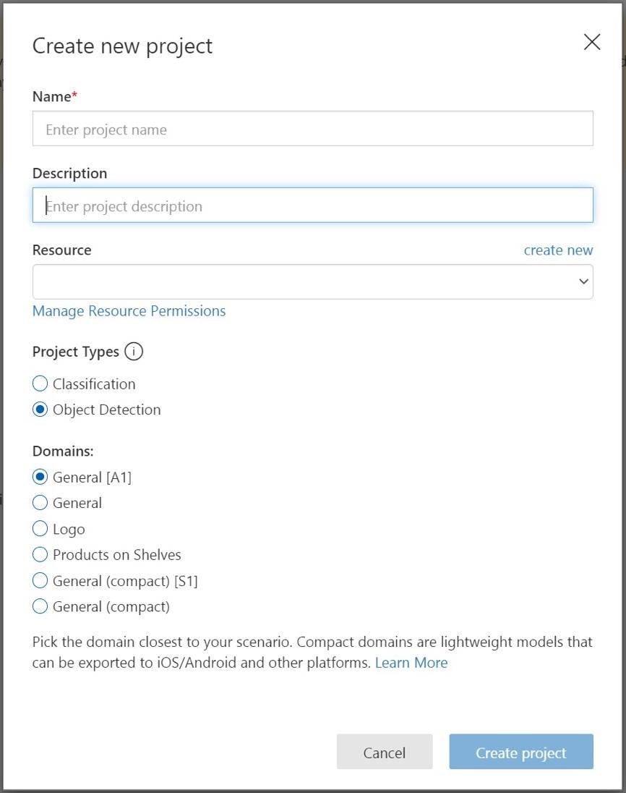

# Task 3 - Create a Custom Vision project

Custom Vision is a part of Cognitive Services that allows you to train your custom image detection and image classification models. In this task, you create a project which will contain your training images and your AI model.

1. In your web browser, navigate to the [Custom Vision web page](https://customvision.ai) and select __Sign in__. Sign in with the same account you used to sign into the Azure portal.

    

1. To create your first project, select **New Project**. The **Create new project** dialog box will appear.

    

1. Enter a name and a description for the project. Then select the Cognitive Services resource you created in the previous task.

   > ##### ℹ️
   > If no resources are available, please confirm that you have logged into [customvision.ai](https://customvision.ai) with the same account as you used to log into the [Azure portal](https://portal.azure.com/). Also, please confirm you have selected the same "Directory" in the Custom Vision website as the directory in the Azure portal where your Cognitive Services resource is located. In both sites, you may select your directory from the drop down account menu at the top right corner of the screen. 

1. Select __Object Detection__ under __Project Types__.

1. Next, select the **General** model (e.g. General A1) from the list of available domains.  Each domain optimizes the detector for specific types of images, as described in the following table. You will be able to change the domain later if you wish.

    |Domain|Purpose|
    |---|---|
    |__General__| Optimized for a broad range of object detection tasks. If none of the other domains are appropriate, or you are unsure of which domain to choose, select the Generic domain. |
    |__Logo__|Optimized for finding brand logos in images.|
    |__Products on shelves__|Optimized for detecting and classifying products on shelves.|
    |__Compact domains__| Optimized for the constraints of real-time object detection on mobile devices. The models generated by compact domains can be exported to run locally.|

1. Finally, select __Create project__.

With the project created, you are now ready to [fill it with some training images](04-Get%20training%20data%20for%20your%20AI%20model.md).
