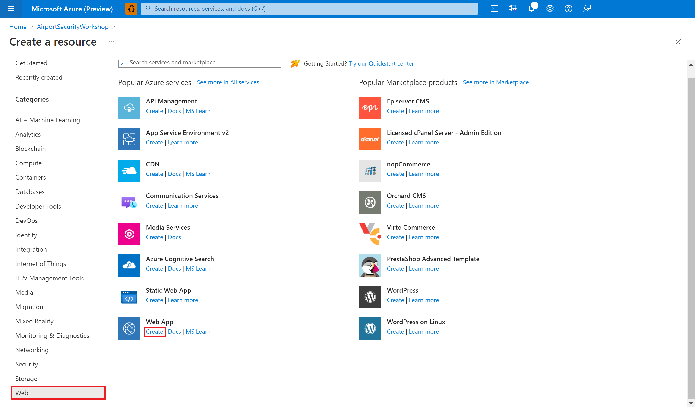
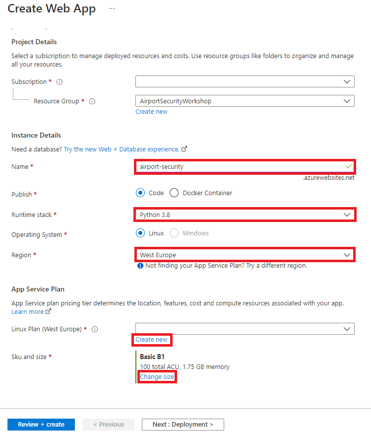
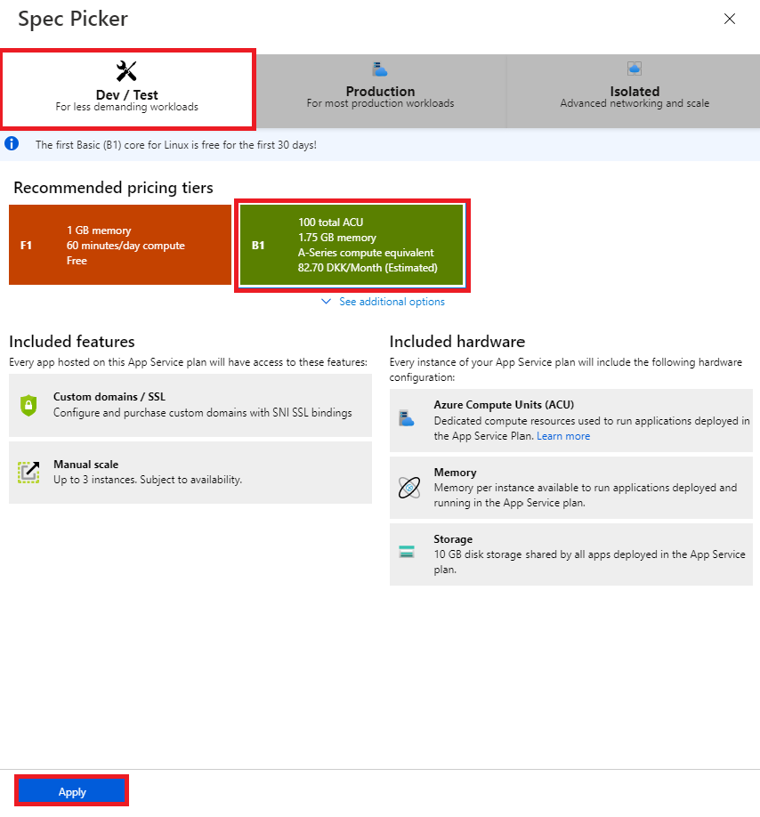

# Task 8 - Provision a Web App resource

Your AI model is up and running - now you only need an application trough which the user can interact with it. Rather than having an application run on your own computer, you will create a web app that all of your colleagues from airport security can access as well. 

1. Return to the [Azure portal](https://portal.azure.com) and create another resource. Do the same steps as you did in [task 2](02-Provision%20a%20Cognitive%20Services%20Resource.md), but instead of **AI + Machine Learning**, select **Web** in the very bottom of the list of categories on the left.
1. Find **Web App** in the list of Azure services and select **Create**.

    

1. Check that the resource is being created in the correct **Subscription** and **Resource Group**. Give your web app a unique **Name** of your choice. Choose **Python 3.8** as the **Runtime stack** and select a **Region**, e.g., **West Europe**. Leave **Publish** and **Operating System** unchanged.

    

    > ##### ℹ️
    > Choose your app's name wisely. It will be used in the URL that you access the app with: *{app-name}.azurewebsites.net*.

1. For **Linux Plan**, select **Create new**. The App Service Plan determines what kind of hardware your web app runs on and how much it costs. Give your App Service Plan and select **OK**. 

1. Under **Sku and size**, select **Change size** to open the Speck Picker. Under **Dev / Test**, select **B1** and click **Apply**.

    

1. On the bottom of the page, select **Review + create**. After the validation has been passed, confirm the resource creation by selecting **Create**.

1. Wait for the deployment to complete and select **Go to resource**.

On the resource page, you can click the **URL** to see your web app in action. It's just a placeholder page at the moment, but you will soon change that. At first, you will [configure the app settings](09-Configure%20your%20Web%20App.md).