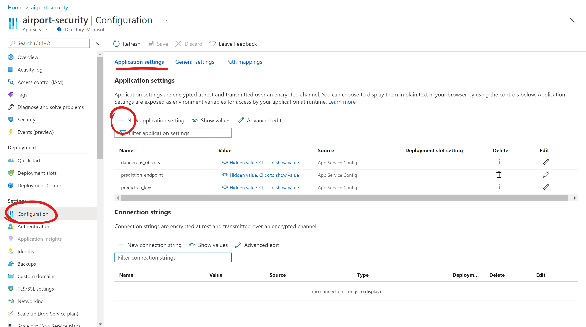

# Task 9 - Configure your Web App

If you visited your Web App already, you have probably seen nothing but a rather uninteresting placeholder page. That means it works at least! You will soon replace that page with your own app. Luckily, all of the code for that has already been written, but a few important pieces of information are missing - specifically those unique to the AI model you trained previously. You will configure the web app to be able to connect to your model in this task.

1. On the resource page of your Web App resource, select **Configuration** on the left-hand side. This will open the page where you can change all kinds of settings, including the application settings. 
1. Add a new application setting by selecting **+ New application setting**.

    

1. A dialogue window will open. For **Name**, type `prediction_key`. For **Value**, use your AI model's prediction key that you hopefully noted down in [Task 7](07-Publish%20your%20model.md). Select **OK** to add the app setting.
1. Add another app setting. This time, with `prediction_endpoint` as the name and the prediction URL of your AI model as the value.

    > ##### ℹ️
    > If you do not know your prediction key and URL, you can review [Task 7](07-Publish%20your%20model.md) on how to find them. You do not need to publish your model again.

1. One last setting remains. You have tought your AI model to detect objects, but it cannot tell you whether those are dangerous or not. You could create another AI model for *classification*, but for now, you can just provide a list of which objects you would like to be considered dangerous. Your web app will highlight any dangerous objects it detects. Consider which objects you trained your model to recognize. Choose a few of those objects to put on your list of dangerous objects that you would like the web app to highlight.
1. Add another app setting with the name `dangerous_objects`. Its value should be a comma-separated list of the objects you have chosen, e.g., `bottle, fork, laptop`. It is fine to include spaces after each comma. 

    > ##### ℹ️
    > If you change your mind about your list of dangerous objects (or your AI model), you can change the app settings at any point. This means that you can change the way your app behaves without having to edit or redeploy the code. How practical!

Now that your app is configured, you are moving closer to actually deploying some code to it. For that, you will be [using the Cloud Shell](10-Set%20up%20your%20Cloud%20Shell.md).