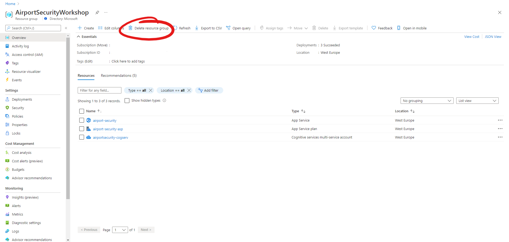

# Task 13 - Cleanup

To avoid incurring additional costs, you can delete the resources you provisioned during this workshop. To do so, find your resource group in the Azure portal and select **Delete resource group**.

> ##### ℹ️
> You might have created another resource group when setting up your Cloud Shell. Make sure you delete this resouce group as well, if it's no longer needed.

If you enjoyed this workshop, and would like to learn more about Microsoft Azure, take a look around the free learning paths on [Microsoft Learn](https://docs.microsoft.com/en-us/learn/).