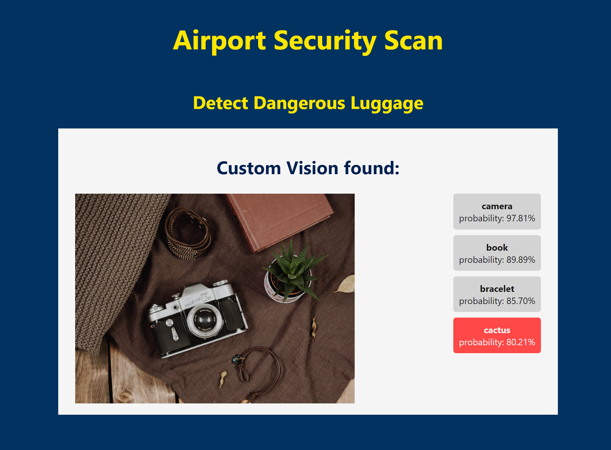

# Introductory Azure Workshop
### Train an AI model for airport security

An introductory Azure workshop guiding participants through the use of Azure Cognitive Services Custom Vision and Azure Web Apps with step-by-step instructions.
As part of this workshop, you will:
- Provision resources through the Azure portal
- Train an object detection AI model with Custom Vision
- Deploy a Web App through the Cloud Shell

## Table of Contents
1. [Prerequisites](Instructions/01-Prerequisites.md)
1. [Provision a Cognitive Services resource](Instructions/02-Provision%20a%20Cognitive%20Services%20resource.md)
1. [Create a Custom Vision project](Instructions/03-Create%20a%20Custom%20Vision%20project.md)
1. [Get training data for your AI model](Instructions/04-Get%20training%20data%20for%20your%20AI%20model.md)
1. [Upload and tag your training data](Instructions/05-Upload%20and%20tag%20your%20training%20data.md)
1. [Train and test your model](Instructions/06-Train%20and%20test%20your%20model.md)
1. [Publish your model](Instructions/07-Publish%20your%20model.md)
1. [Provision a Web App resource](Instructions/08-Provision%20a%20Web%20App%20resource.md)
1. [Configure your Web App](Instructions/09-Configure%20your%20Web%20App.md)
1. [Set up your Cloud Shell](Instructions/10-Set%20up%20your%20Cloud%20Shell.md)
1. [Deploy your Web App](Instructions/11-Deploy%20your%20Web%20App.md)
1. [Ready for takeoff!](Instructions/12-Ready%20for%20takeoff!.md)
1. [Cleanup](Instructions/13-Cleanup.md)
